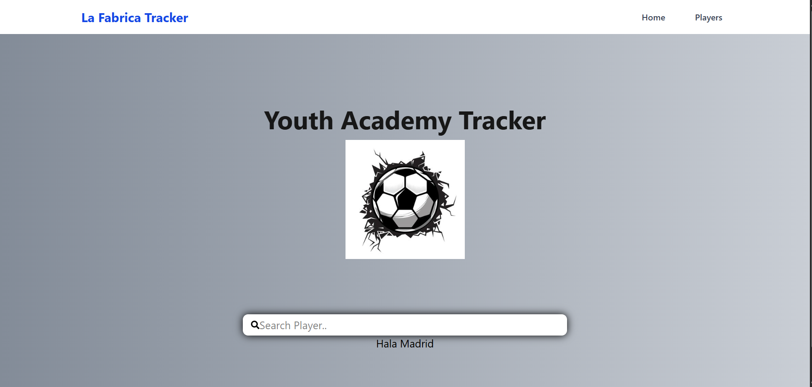
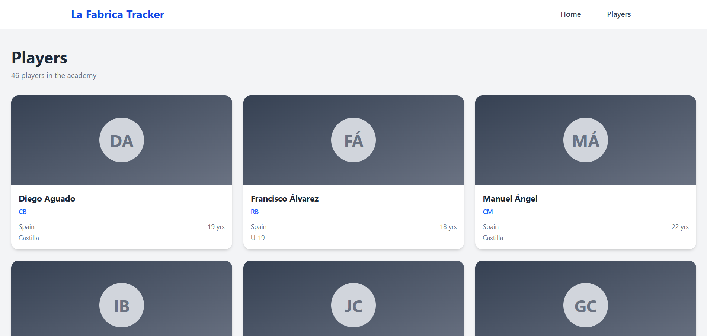
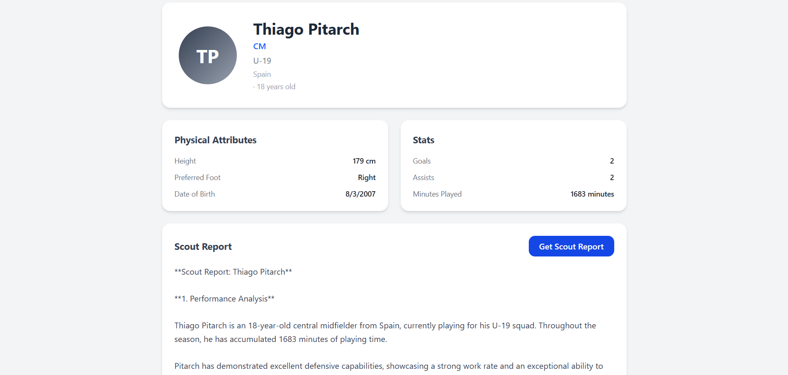

# La Fabrica - Real Madrid Youth Tracker

A web application for tracking Real Madrid youth academy players. La Fabrica provides detailed player profiles including physical attributes 
and season statistics, with AI-powered scout reports generated using the Groq LLaMA model.

## 🚀 Features
- Browse and search Real Madrid youth academy players
- View detailed player profiles with physical attributes and season stats
- AI-generated scout reports powered by Groq's open source LLaMA model(a lightweight open-source large language model).
- Clean, responsive UI built with React and Tailwind CSS
  
# 🛠️ Technologies Used
**Frontend**
- React + Vite
- Tailwind CSS
- HTML / JavaScript
  
**Backend**
- Node.js + Express
- PostgreSQL
- Groq API (LLaMA LLM)
## 📸 Screenshots
### Home Page

### Player Profile

### Scout Report

### Steps

1. Clone the repository
   git clone https://github.com/yourusername/La-Fabrica-Tracker.git

2. Install backend dependencies
   cd LaFabrica_Backend
   npm install

3. Install frontend dependencies
   cd ../LaFabrica_Frontend
   npm install
   
4. Create the database
   - Open pgAdmin and create a new database called LaFabrica_Players
   - Open the Query Tool and run the database.sql file included in the repo

5. Create a .env file in the backend folder
   DB_USER=your_db_user
   DB_PASSWORD=your_db_password
   DB_HOST=localhost
   DB_PORT=5432
   DB_NAME=your_db_name
   GROQ_API_KEY=your_groq_api_key

6. Start the backend
   cd LaFabrica_Backend
   npm start

7. Start the frontend
   cd LaFabrica_Frontend
   npm run dev
