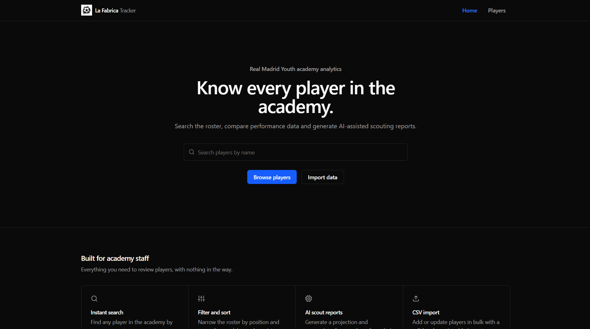
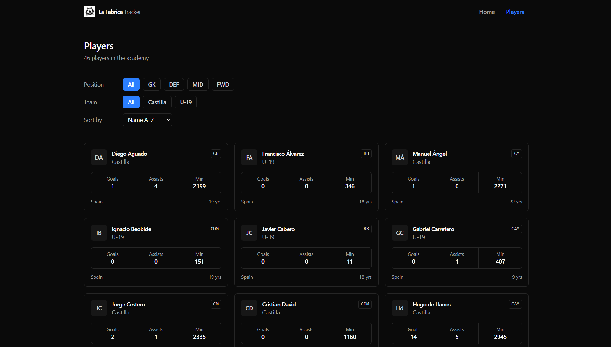
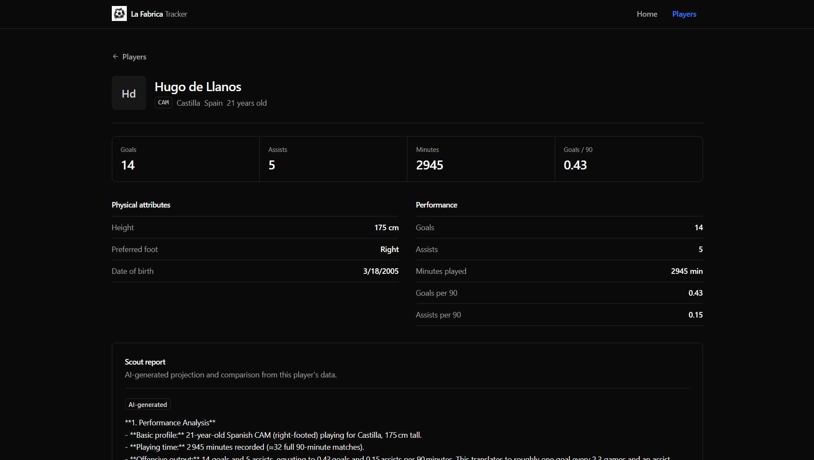
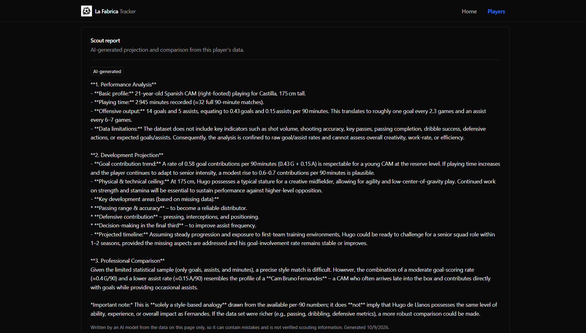

# La Fabrica - Real Madrid Youth Tracker

A web app for tracking Real Madrid youth academy players. It provides player profiles with physical attributes and season statistics, plus AI-generated scout reports from Groq's LLaMA models.

This is an unofficial fan project I made for fun and IAM NOT affiliated with Real Madrid.
Also all stats and information are based on the official Real Madrid site and Transfermarkt

## Features

- Search the academy roster by name
- Filter by position and team, and sort by age, goals, assists or minutes
- Player profiles with physical attributes, season stats and per-90 figures
- AI scout reports, stored per player and rate-limited
- Admin CSV import with a preview before anything is saved (look at the [docs/CSV_IMPORT.md](docs/CSV_IMPORT.md))
- Responsive interface

## Tech stack used

**Frontend:** React, Vite, Tailwind CSS, React Router

**Backend:** Node.js, Express, PostgreSQL, Groq API (LLaMA)

## Screenshots






## Getting started

Requires Node.js 20+, PostgreSQL, and a Groq API key.

1. Clone the repository

```
   git clone https://github.com/SVENNCODE/LaFabrica-Tracker.git
   cd LaFabrica-Tracker
```

2. Install dependencies

```
   cd LaFabrica_Backend && npm install
   cd ../LaFabrica_Frontend && npm install
```

3. Create a PostgreSQL database named `LaFabrica_Players`

4. Configure the backend: copy `LaFabrica_Backend/.env.example` to `LaFabrica_Backend/.env` and fill in at least:

```
   DB_USER=
   DB_PASSWORD=
   DB_HOST=localhost
   DB_PORT=5432
   DB_NAME=LaFabrica_Players
   GROQ_API_KEY=
   ADMIN_API_KEY=
   FRONTEND_ORIGIN=http://localhost:5173
```

5. Configure the frontend: copy `LaFabrica_Frontend/.env.example` to `LaFabrica_Frontend/.env`

```
   VITE_API_URL=http://localhost:3000
```

6. Set up the database

```
   cd LaFabrica_Backend
   npm run migrate
```

7. Start the backend (http://localhost:3000)

```
   npm run dev
```

8. Start the frontend (http://localhost:5173)

```
   cd ../LaFabrica_Frontend
   npm run dev
```

## Tests

```
cd LaFabrica_Backend
npm test
```

The tests wipe the `players` table, so point them at a separate test database.
   cd LaFabrica_Frontend
   npm run dev
